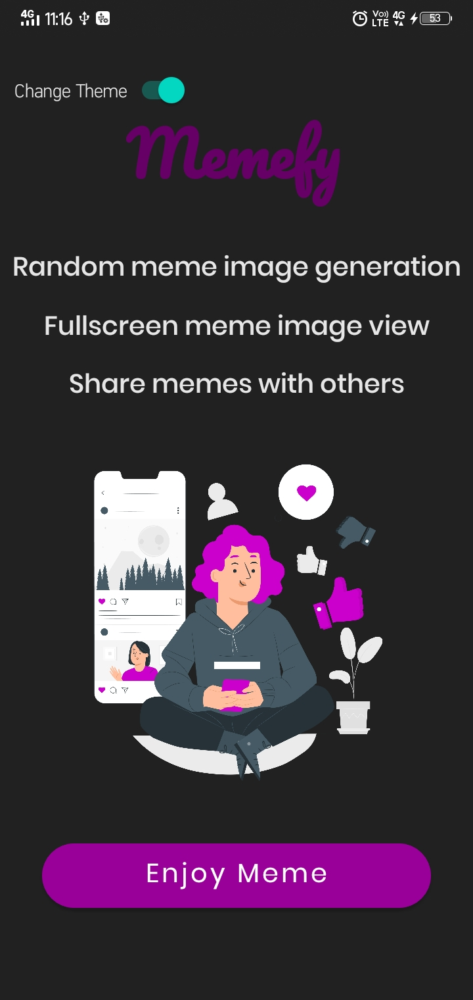
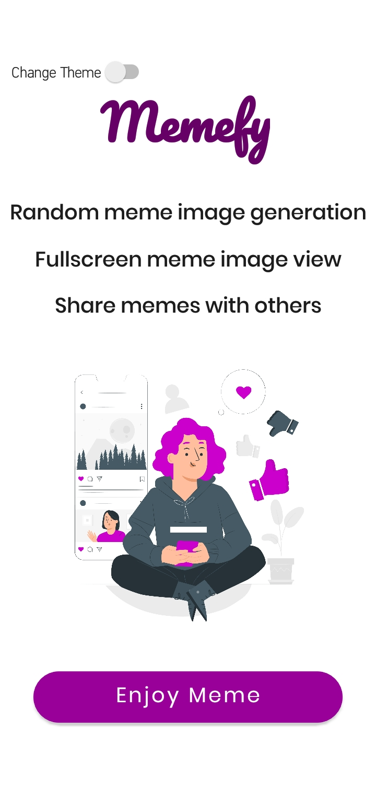
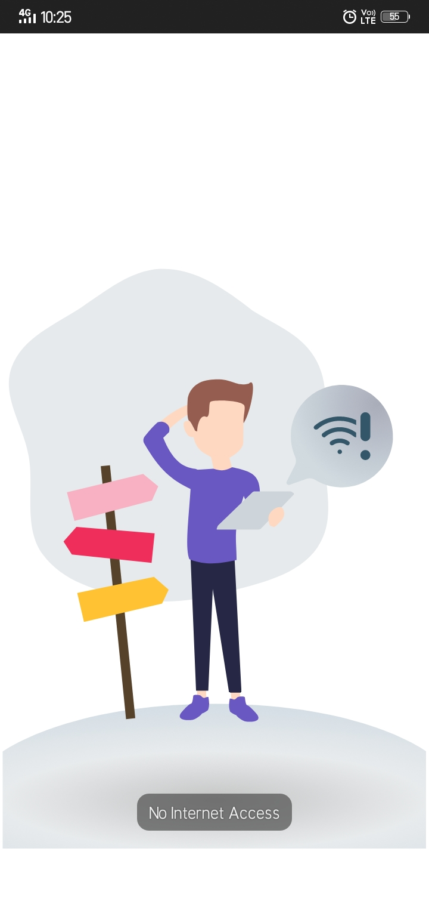
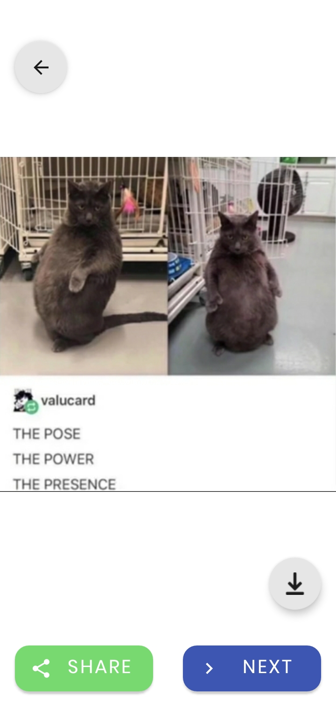
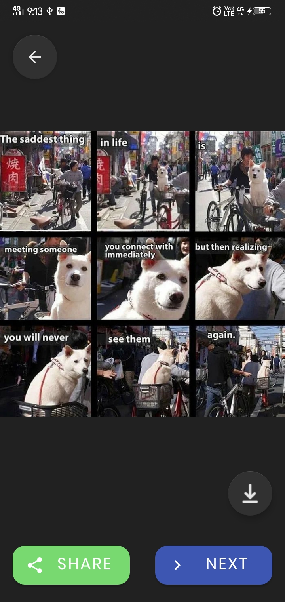
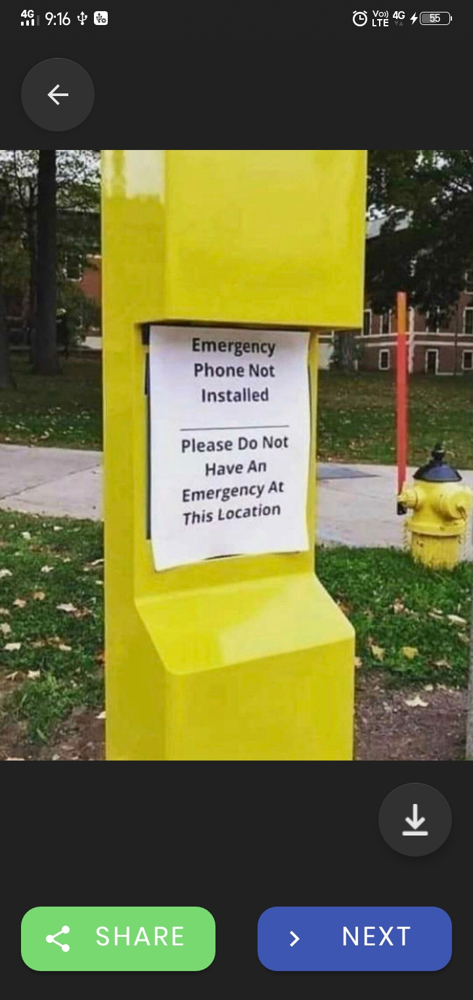

# Random Meme Genrator app

We all love watching and sharing memes using this app user can 
watch random memes and share memes with others.

<div align = "center">

  
</div>

<div align = "center">

  
</div>

You can download the app from this [link!](https://drive.google.com/file/d/1NtZ_L85Pgb6DDt38BASEwR7LooygWWTi/view?usp=sharing)

## Features

- Random meme image generation
- Fullscreen meme image view
- Share memes with others

  
## Tech Stack

- Java
- XML
- Third party libraries such as Retrofit and Glide are allowed.


## App screenshots

<div>
    
    
    
    
    
    
    
  
</div>
  
## API Reference

JSON API for a random meme scraped from reddit.

API Link : [https://meme-api.herokuapp.com/gimme](https://meme-api.herokuapp.com/gimme)

**Example Response:**

```jsonc
{
  "postLink": "https://redd.it/jiovfz",
  "subreddit": "dankmemes",
  "title": "*leaves call*",
  "url": "https://i.redd.it/f7ibqp1dmiv51.gif",
  "nsfw": false,
  "spoiler": false,
  "author": "Spartan-Yeet",
  "ups": 3363,

  // preview images of the meme sorted from lowest to highest quality
  "preview": [
    "https://preview.redd.it/f7ibqp1dmiv51.gif?width=108&crop=smart&format=png8&s=02b12609100c14f55c31fe046f413a9415804d62",
    "https://preview.redd.it/f7ibqp1dmiv51.gif?width=216&crop=smart&format=png8&s=8da35457641a045e88e42a25eca64c14a6759f82",
    "https://preview.redd.it/f7ibqp1dmiv51.gif?width=320&crop=smart&format=png8&s=f2250b007b8252c7063b8580c2aa72c5741766ae",
    "https://preview.redd.it/f7ibqp1dmiv51.gif?width=640&crop=smart&format=png8&s=6cd99df5e58c976bc115bd080a1e6afdbd0d71e7"
  ]
}
```

### Custom Endpoints

#### Specify count (MAX 50)

In order to get multiple memes in a single request specify the count with the following endpoint.

Endpoint: [/gimme/{count}](https://meme-api.herokuapp.com/gimme/2)

Example: [https://meme-api.herokuapp.com/gimme/2](https://meme-api.herokuapp.com/gimme/2)

Response:

```jsonc
{
  "count": 2,
  "memes": [
    {
      "postLink": "https://redd.it/jictqq",
      "subreddit": "dankmemes",
      "title": "Say sike",
      "url": "https://i.redd.it/j6wu6o9ncfv51.gif",
      "nsfw": false,
      "spoiler": false,
      "author": "n1GG99",
      "ups": 72823,
      "preview": [
        "https://preview.redd.it/j6wu6o9ncfv51.gif?width=108&crop=smart&format=png8&s=3b110a4d83a383b7bfebaf09ea60d89619cddfb3",
        "https://preview.redd.it/j6wu6o9ncfv51.gif?width=216&crop=smart&format=png8&s=ba5808992b3245a6518dfe759cbe4af24e042f2d",
        "https://preview.redd.it/j6wu6o9ncfv51.gif?width=320&crop=smart&format=png8&s=7567bb64e639223e3603236f774eeca149551313"
      ]
    },
    {
      "postLink": "https://redd.it/jilgdw",
      "subreddit": "dankmemes",
      "title": "I forgot how hard it is to think of a title",
      "url": "https://i.redd.it/jk12rq8nrhv51.jpg",
      "nsfw": false,
      "spoiler": false,
      "author": "TheRealKyJoe01",
      "ups": 659,
      "preview": [
        "https://preview.redd.it/jk12rq8nrhv51.jpg?width=108&crop=smart&auto=webp&s=d5d3fe588ccff889e61fca527c2358e429845b80",
        "https://preview.redd.it/jk12rq8nrhv51.jpg?width=216&crop=smart&auto=webp&s=b560b78301afd8c173f8c702fbd791214c1d7f61",
        "https://preview.redd.it/jk12rq8nrhv51.jpg?width=320&crop=smart&auto=webp&s=3cd427240b2185a3691a818774214fd2a0de124d",
        "https://preview.redd.it/jk12rq8nrhv51.jpg?width=640&crop=smart&auto=webp&s=1142cc19a746b8b5d8335679d1d36127f4a677b9"
      ]
    }
  ]
}
```

#### Specify Subreddit

By default the API grabs a random meme from '_memes_', '_dankmemes_', '_me_irl_' subreddits. To provide your own custom subreddit use the following endpoint.

Endpoint: [/gimme/{subreddit}](https://meme-api.herokuapp.com/gimme/wholesomememes)

Example: [https://meme-api.herokuapp.com/gimme/wholesomememes](https://meme-api.herokuapp.com/gimme/wholesomememes)

Response:

```json
{
  "postLink": "https://redd.it/jhr5lf",
  "subreddit": "wholesomememes",
  "title": "Every time I visit",
  "url": "https://i.redd.it/hsyyeb87v7v51.jpg",
  "nsfw": false,
  "spoiler": false,
  "author": "pak_choy",
  "ups": 1660,
  "preview": [
    "https://preview.redd.it/hsyyeb87v7v51.jpg?width=108&crop=smart&auto=webp&s=b76ddb91f212b2e304cad2cd9c5b71a6ddca832c",
    "https://preview.redd.it/hsyyeb87v7v51.jpg?width=216&crop=smart&auto=webp&s=2bd0b104fd0825afc15d9faa7977c6801e6dae0b",
    "https://preview.redd.it/hsyyeb87v7v51.jpg?width=320&crop=smart&auto=webp&s=7625c69e144c9cb187dd0be88f541918aca5cedd",
    "https://preview.redd.it/hsyyeb87v7v51.jpg?width=640&crop=smart&auto=webp&s=e933f956e01d62810e68f12ed8b26a8178ecbb0f"
  ]
}
```

#### Specify Subreddit Count (MAX 50)

In order to get a custom number of memes from a specific subreddit provide the name of the subreddit and the count in the following endpoint.

Endpoint: [/gimme/{subreddit}/{count}](https://meme-api.herokuapp.com/gimme/wholesomememes/2)

Example: [https://meme-api.herokuapp.com/gimme/wholesomememes/2](https://meme-api.herokuapp.com/gimme/wholesomememes/2)

Response:

```json
{
  "count": 2,
  "memes": [
    {
      "postLink": "https://redd.it/ji1riw",
      "subreddit": "wholesomememes",
      "title": "It makes me feel good.",
      "url": "https://i.redd.it/xuzd77yl8bv51.png",
      "nsfw": false,
      "spoiler": false,
      "author": "polyesterairpods",
      "ups": 306,
      "preview": [
        "https://preview.redd.it/xuzd77yl8bv51.png?width=108&crop=smart&auto=webp&s=9a0376741fbda988ceeb7d96fdec3982f102313e",
        "https://preview.redd.it/xuzd77yl8bv51.png?width=216&crop=smart&auto=webp&s=ee2f287bf3f215da9c1cd88c865692b91512476d",
        "https://preview.redd.it/xuzd77yl8bv51.png?width=320&crop=smart&auto=webp&s=88850d9155d51f568fdb0ad527c94d556cd8bd70",
        "https://preview.redd.it/xuzd77yl8bv51.png?width=640&crop=smart&auto=webp&s=b7418b023b2f09cdc189a55ff1c57d531028bc3e"
      ]
    },
    {
      "postLink": "https://redd.it/jibifc",
      "subreddit": "wholesomememes",
      "title": "It really feels like that",
      "url": "https://i.redd.it/vvpbl29prev51.jpg",
      "nsfw": false,
      "spoiler": false,
      "author": "lolthebest",
      "ups": 188,
      "preview": [
        "https://preview.redd.it/vvpbl29prev51.jpg?width=108&crop=smart&auto=webp&s=cf64f01dfaca5f41c2e87651e4b0e321e28fa47c",
        "https://preview.redd.it/vvpbl29prev51.jpg?width=216&crop=smart&auto=webp&s=33acdf7ed7d943e1438039aa71fe9295ee2ff5a0",
        "https://preview.redd.it/vvpbl29prev51.jpg?width=320&crop=smart&auto=webp&s=6a0497b998bd9364cdb97876aa54c147089270da",
        "https://preview.redd.it/vvpbl29prev51.jpg?width=640&crop=smart&auto=webp&s=e68fbe686e92acb5977bcfc24dd57febd552afaf",
        "https://preview.redd.it/vvpbl29prev51.jpg?width=960&crop=smart&auto=webp&s=1ba690cfe8d49480fdd55c6daee6f2692e9292e7",
        "https://preview.redd.it/vvpbl29prev51.jpg?width=1080&crop=smart&auto=webp&s=44852004dba921a17ee4ade108980baab242805e"
      ]
    }
  ]
}
```


  ## Building

#### With Gradle

This project requires the [Android SDK](http://developer.android.com/sdk/index.html)
to be installed in your development environment. In addition you'll need to set
the `ANDROID_HOME` environment variable to the location of your SDK. For example:

    export ANDROID_HOME=/home/<user>/tools/android-sdk

After satisfying those requirements, the build is pretty simple:

* Run `./gradlew build installDevelopmentDebug` from the within the project folder.
It will build the project for you and install it to the connected Android device or running emulator.

The app is configured to allow you to install a development and production version in parallel on your device.

#### With Android Studio
The easiest way to build is to install Android Studio
with Gradle([Installation video](https://www.youtube.com/watch?v=0zx_eFyHRU0&t=8s)).
 
Once installed, then you can import the project into Android Studio:

1. Open `File`
2. Import Project
3. Select `build.gradle` under the project directory
4. Click `OK`

Then, Gradle will do everything for you.
## Contributing

Contributions are always welcome!

See [CONTRIBUTING.md](https://github.com/clubgamma/Random-Meme-Generator-App/blob/main/CONTRIBUTING.md) for ways to get started.

Please adhere to this project's [Code of Conduct](https://github.com/clubgamma/code-of-conduct).

  
## Things to keep in mind

- **Before creating any Pull Request, please register yourself at [Hacktoberfest's Official Website](https://hacktoberfest.digitalocean.com/)**
- **If a maintainer reports behavior that’s not in line with the project’s code of conduct, then you will be ineligible to participate.**
- **To get Digital Ocean swags, you just have to make minimum 4 PRs to any open source projects on GitHub**
- **If a maintainer reports your pull request as spam, it will not be counted towards your participation in Hacktoberfest.**

  
## Contact us

**To know more about us, visit [official website](https://clubgamma.github.io/) of Club Gamma.**

**To know more about how Club Gamma is going to celebrate Hacktoberfest, click [here](https://clubgamma.github.io/hacktoberfest2021/)**

<br>

<div align = "center">

</div>


<div align="center">  
<i>If you want to add any feature or if you found a bug, feel free to open an issue</i><br><br>


<br>
<a ></a><br>
<br>

</div>

  
